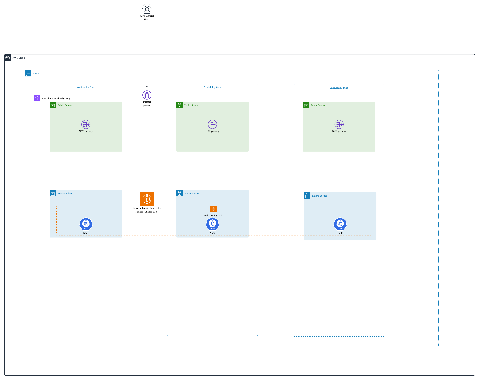
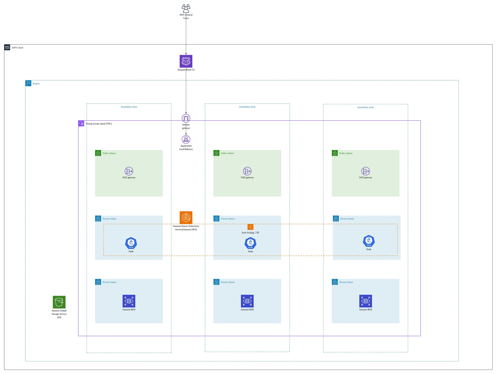
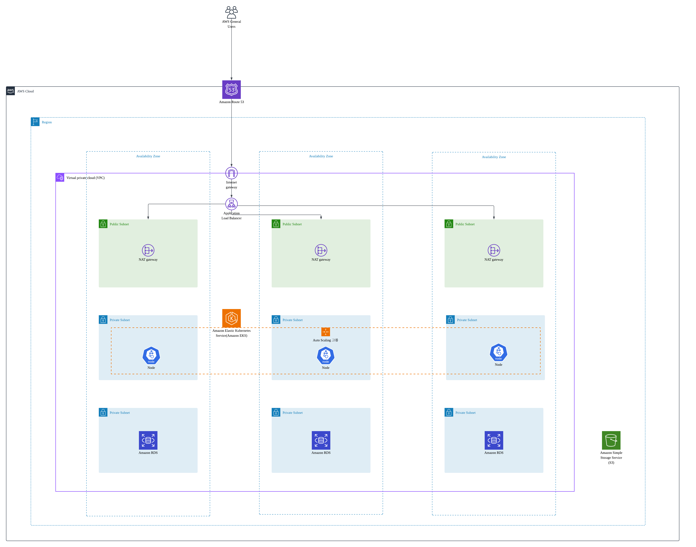
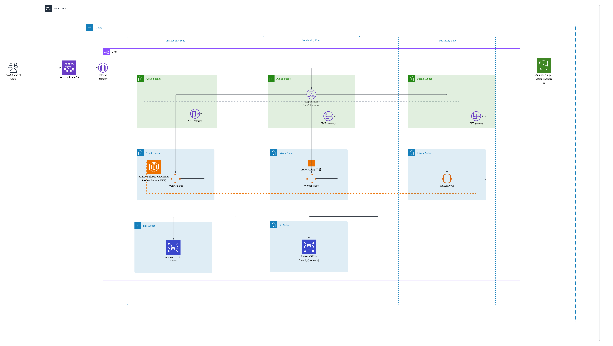
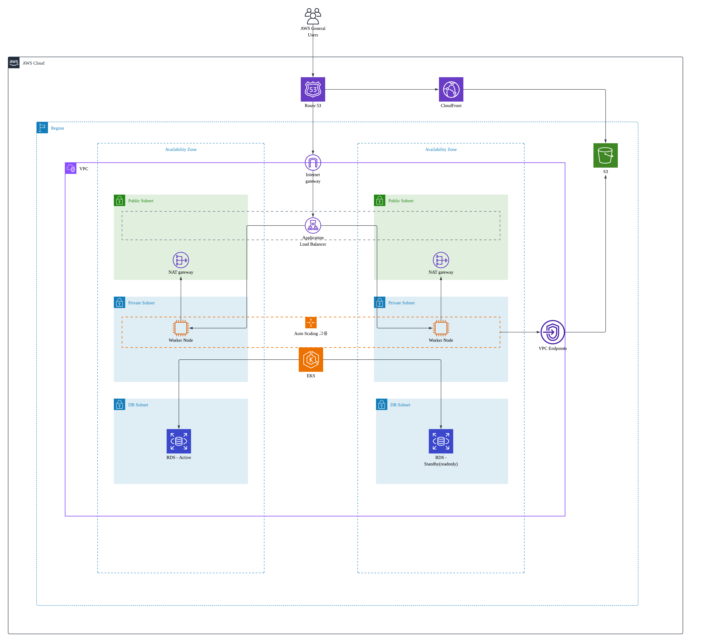
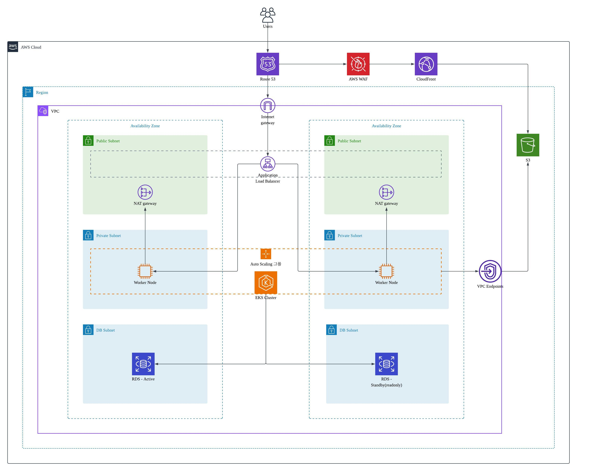
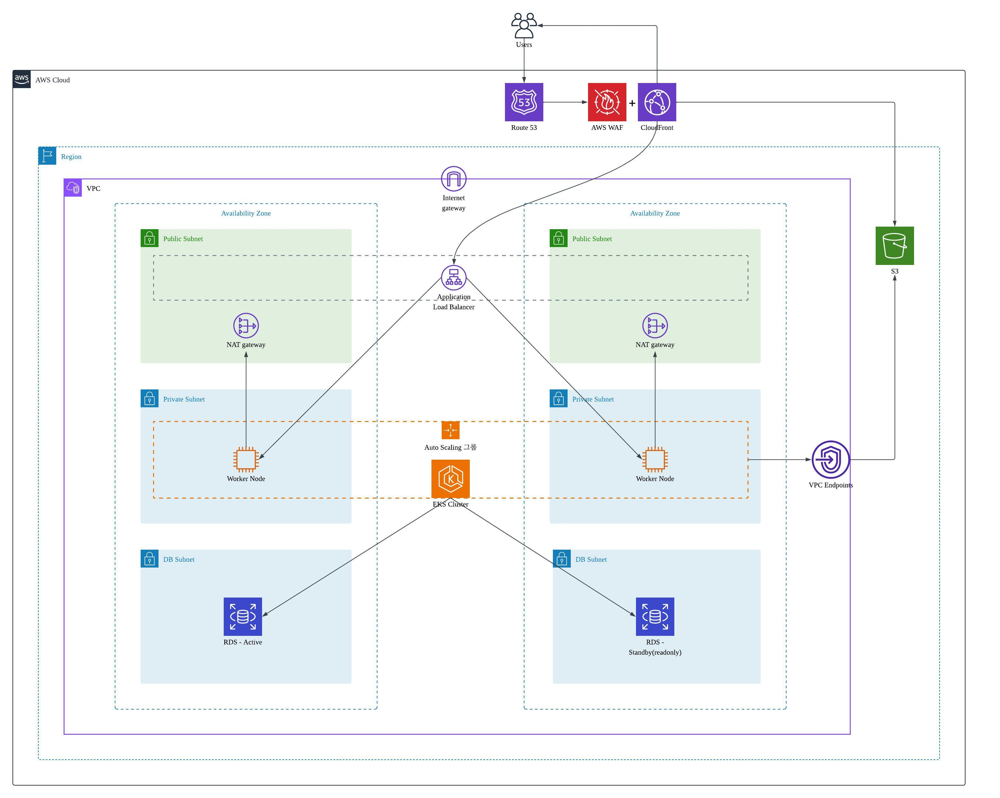
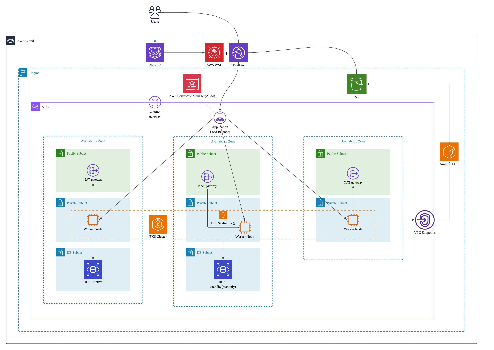

# AWS Infrastructure Architecture Design Log

## v0.1 - 초기 구조



### 구성 요소

기본적인 AWS 인프라 골격을 구성했다.

- 1개 Region, 3개 AZ
- VPC, Internet Gateway
- Public Subnet 3개 + Private Subnet 3개
- NAT Gateway 3개
- EKS Worker Node 3개 (Auto Scaling Group)

### 문제점

1. IP 직접 접근 구조의 한계<br>
   사용자가 IP로 직접 접근하는 구조로 ALB 교체 시 엔드포인트가 변경될 위험이 있다. 도메인 기반 라우팅이 불가능하고 DNS 레벨의 트래픽 분산 및 Failover 제어도 어렵다.
2. L7 라우팅 불가<br>
   Application Layer 기반 라우팅이 없어서 path 또는 host 기반으로 서비스를 분리하기 어렵다.
   - `/api/` -> api service
   - `api.domain.com` -> backend
   - `web.domain.com` -> frontend

3. 데이터 계층 미분리<br>
   DB 계층이 설계에 포함되어 있지 않아서 애플리케이션이 상태(state)를 어디에 저장할지 정의되지 않은 구조다. 이 상태로 서비스를 운용하면 데이터 영속성을 보장할 수 없다.

## v0.2 — DNS 및 로드밸런서 도입 및 DB 계층 분리



### 개선 사항

v0.1의 IP 직접 접근 문제와 데이터 계층 부재 문제를 해결했다.

- `Route53` 도입으로 도메인 기반 라우팅 및 DNS 레벨 트래픽 제어 가능
- `ALB(Application Load Balancer)` 도입으로 L7 라우팅 지원
- `DB 전용 Private Subnet` 3개 추가 — 네트워크 격리로 보안성 강화
- `RDS` 3개 구성으로 데이터 계층 분리
- `S3` 추가
- 트래픽 흐름 명확화: 사용자 -> Route53 -> Internet Gateway -> ALB

### 문제점

ALB 이후 트래픽이 어느 경로로 흘러가는지 다이어그램에서 명확히 표현되지 않았다.

## v0.3 — ALB 트래픽 흐름 표현



### 개선 사항

- ALB를 통해 트래픽이 각 AZ의 Public Subnet으로 분산된다는 흐름을 다이어그램에 명시

### 문제점

- 트래픽 이동 경로가 여전히 불명확하고 연결선이 복잡하여 다이어그램의 가독성이 떨어진다.
- 워커 노드가 EKS 소속임을 직관적으로 알기 어렵고, Kubernetes 네이티브 노드처럼 보인다.
- RDS를 AZ당 1개씩 총 3개 배치했으나 Active/Standby 같은 HA 구성이 아닌 단순 배치로 비용 대비 효과가 낮다.

## v0.4 — 다이어그램 명확화 및 RDS 구성 도입



### 개선 사항

- `ALB를 점선 영역으로 표시`하여 하나의 ALB가 여러 Public Subnet에 논리적으로 걸쳐 있음을 표현
- `워커 노드 아이콘 변경`으로 EKS 클러스터 소속임을 명확히 표현
- 워커 노드 -> NAT Gateway 트래픽 흐름 추가
- EKS 클러스터 -> RDS 연결선 추가로 DB 접근 경로 명확화
- `RDS 3개 -> Active + Standby(readonly) 2개로 재구성` — 단순 배치에서 벗어나 실질적인 HA 구조를 처음으로 도입하면서 동시에 비용도 절감

### 문제점

- 서비스 규모 대비 AZ 3개는 과하다고 판단된다.
- S3를 로그용으로 사용할 경우 트래픽 경로가 없고 NAT Gateway를 경유하면 불필요한 비용이 발생한다.
- 프론트엔드 정적 파일 서빙 비용이 증가할 수 있다.

## v0.5 — 비용 최적화 전반 개선



### 개선 사항

v0.4에서 제기된 AZ 과잉, NAT Gateway 경유 비용, 정적 파일 서빙 비용 문제를 한번에 개선했다.

- `AZ 3개 -> 2개로 축소` — 서비스 규모에 맞게 인프라 슬림화
- `CloudFront` 추가 — 정적 파일을 엣지에서 캐싱하여 응답 속도 개선 및 오리진 서버 부하 감소
- `VPC Endpoints` 추가 — EKS에서 S3로 NAT Gateway를 거치지 않고 AWS 내부망으로 직접 통신하여 비용 절감
- 연결 경로 추가: `EKS -> VPC Endpoints -> S3`

### 문제점

- 악성 트래픽(DDoS, 봇 등)에 대한 방어 수단이 없다.
- 특정 IP 차단 기능이 없다.

## v0.6 — 보안 강화



### 개선 사항

- `WAF(Web Application Firewall)` 추가 — Route53과 CloudFront 사이에 배치하여, 악성 트래픽이 오리진 서버까지 도달하기 전에 엣지 레벨에서 차단. DDoS 방어, 봇 차단, IP 기반 접근 제어 등 보안 정책 적용 가능

### 문제점

- CloudFront에서 트래픽 분기 로직이 표현되지 않음
- WAF가 CloudFront 앞단에만 위치하므로 ALB로 직접 유입되는 트래픽은 WAF 보안 정책이 적용되지 않음
- Route53에서 CloudFront와 ALB로 향하는 두 개의 경로가 존재해 트래픽 흐름이 불명확함

<details>
  <summary>정보</summary>
CDN 동작 흐름이 헷갈려서 정리함.
CloudFront의 동작 흐름 정리

```
# case1
User -> Route53
                -> WAF + CloudFront
                                    -> 응답
                                    -> S3 -> 응답
                -> ALB -> 응답
# case2
User -> Route53 -> WAF + CloudFront
                                      -> 응답
                                      -> S3 -> 응답
                                      -> ALB -> 응답
```

1. User -> Route53
   - 사용자(브라우저) 요청 `https://cdn.example.com/image.png`

2. Route53에서 레코드 구분
   - CloudFront 배포 도메인을 등록하면 CloudFront로, ALB 도메인을 등록하면 ALB로, 레코드를 어떻게 등록했냐에 따라 구분됨.
     예) www.example.com -> A 레코드 (Alias) -> xxxx.cloudfront.net
     예) api.example.com -> A 레코드 (Alias) -> my-alb-xxxx.ap-northeast-2.elb.amazonaws.com
   - ALB 도메인 따로 등록하지 않고 모든 요청을 CloudFront로 보낼 수 있음.

3. Route53에서 가장 가까운 CloudFront Edge로 DNS 응답
   - Route53은 CloudFront distribution domain 반환 `cdn.example.com -> dxxxxx.cloudfront.net`
   - Route53 -> CloudFront 도메인 IP 반환 -> AWS Anycast 네트워크가 자동으로 가장 가까운 엣지로 라우팅

4. CloudFront Edge에서 캐시 확인
   - 캐시에 image.png 있니?
   - case1. Cache HIT
     있으면, S3로 가지 않고 CloudFront -> 바로 사용자 응답.
   - case2. Cache MISS
     없으면, CloudFront -> Origin(S3 등)에 요청(HTML, CSS, JS, 이미지 등)
     Origin -> CloudFront 엣지에 응답 + 엣지에 캐시 저장
     CloudFront -> 사용자 응답
     다음 요청부터는 HIT으로 처리됨.
   - case3. 동적 요청의 경우 ALB로 보냄.

- 동적 요청인 경우 User -> Route 53 -> ALB 로 가거나 User -> Route53 -> CloudFront -> ALB 로 가게 할 수 있다. 이때 동적요청도 CloudFront를 거치므로 CloudFront 데이터 전송 비용이 추가된다. 캐시도 안되는 API 요청까지 CloudFront를 통과시키는 거라 비용 낭비가 될 수 있음.
- WAF를 추가한다 했을 때, ALB와 CloudFront 2개에 붙이는 것과 CloudFront에만 붙이고 모든 요청을 CloudFront에 보내는 방법이 나을 수 있다.
- WAF+CloudFront로 하고 모든 요청이 CloudFront를 거친다고 했을 때 어떤 요청이 Cloudfront를 우회해서 ALB에 직접 접근하는 경우로 공격이 들어올 수 있는가..?
- 어떤 방법이 비용과 복잡성 측면에서 나은 방법인가..?

- 결론 : 모든 요청을 CloudFront로 보낸 후 CloudFront에서 분기처리.

장점

1. 보안 단순화
   - WAF를 CloudFront 하나에만 붙이면 끝.
   - ALB에 별도 WAF 가 붙지 않으니 관리 포인트가 줄어든다.
2. ALB/EKS IP 숨기기.
   - 외부에서 ALB IP를 몰라서 직접 공격이 불가하다.
   - CloudFront에서 오는 요청만 ALB가 받도록 잠글 수 있다.
3. 정적/동적 도메인 통일
   - `www.example.com` 하나로 정적/동적 모두 처리 가능
   - 프론트엔드 입장에서 API 주소 따로 관리할 필요 없음
4. AWS 백본 네트워크 활용
   - CloudFront -> ALB 구간이 공인 인터넷이 아닌 AWS 내부망을 타서 안정적이다.

단점

1. 비용 증가
   - 캐시 안되는 동적 요청까지 CLoudFront 데이터 전송 비용이 발생.
   - 트래픽이 많을 수록 차이가 커짐.
     > 이제 막 시작한 서비스이므로 트래픽이 많지 않을 것으로 예상.
     > 트래픽이 많아지면 분리하는 방법을 그 때 고려하는 것이 나을 것 같다고 판단.
2. 레이턴시 소폭 증가
   - 동적 요청은 어차피 Origin까지 가야 하는데 CloudFront 홉이 하나 더 추가됨
   - 엄격한 레이턴시 요구사항엔 영향 가능
     > 투두 앱은 가벼운 서비스이기때문에 레이턴시 증가가 매우 미미할 것으로 예상된다.
3. 캐시 설정 실수 위험
   - /api/\* 가 실수로 캐시되면 개인정보 노출 같은 심각한 버그 발생 가능
     > CloudFront Behavior에서 /api/\* 경로를 명시적으로 캐시 비활성화하도록 한다.
     > AWS 관리형 CachingDisabled 정책을 적용해서 캐시 자체가 불가능하도록 설정가능
4. 디버깅 복잡도 증가
   - 문제 생겼을 때 CloudFront인지 ALB인지 EKS인지 레이어가 하나 더 늘어남
     > CloudFront는 X-Cache 헤더를 응답에 자동으로 붙여 주므로 어느 레이어에서 응답했는지 바로 파악 가능
     > 복잡한 추적이 필요하면 X-Ray로 전 구간 트레이싱이 가능하다고 함. 투두 앱 수준에서는 X-Cache 헤더만으로 충분히 디버깅 가능할 것으로 판단됨.

</details>

## v0.7



### 개선 사항

- Route53에서 ALB로 향하던 직접 경로 제거
- 모든 트래픽을 Route53 -> WAF -> CloudFront로 단일화
- CloudFront에서 3가지로 분기
  - 캐시 HIT -> 사용자에게 바로 응답
  - 캐시 MISS + 정적 리소스 -> S3
  - 동적 요청 -> Internet Gateway -> ALB -> EKS
- CloudFront는 AWS 내부망으로 직접 ALB에 연결할 수 있으므로 Internet Gateway를 거치지 않고 직접 연결로 변경

**ALB의 Security Group에서 CloudFront의 IP 대역만 허용하도록 SecurityGroup 정책문서 별도 작성 필요**

### 문제점

- HTTPS 적용을 위한 TLS 인증서 관리 방법 미표현

## v0.8



### 개선 사항

- AWS Certificate Manager(ACM) 추가
- ACM → ALB 연결로 HTTPS 처리 흐름 명시

### 문제점

(고민 중)
