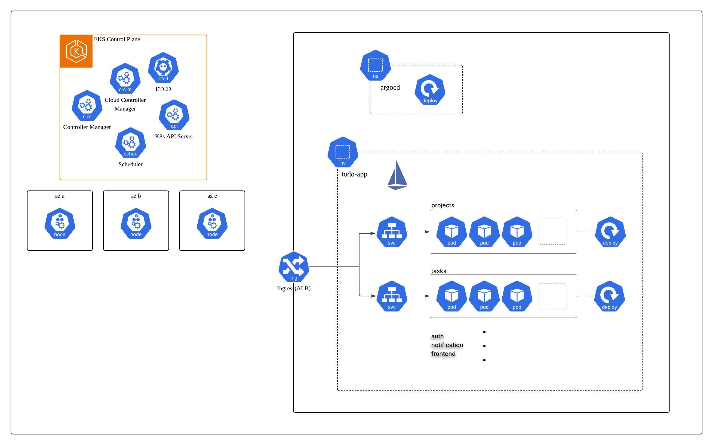
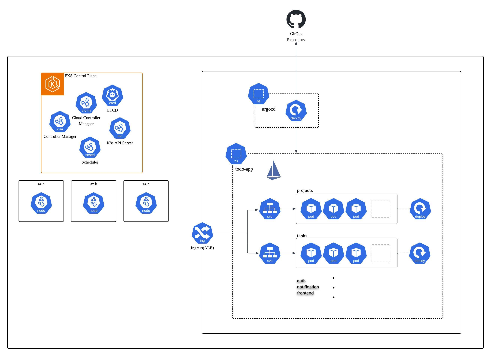
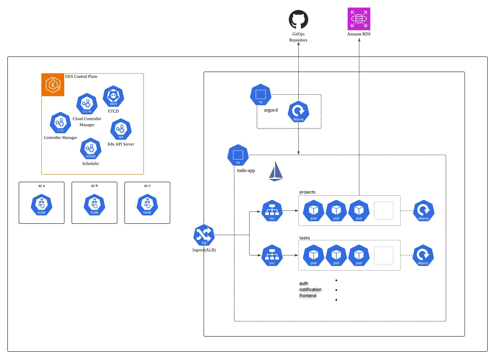
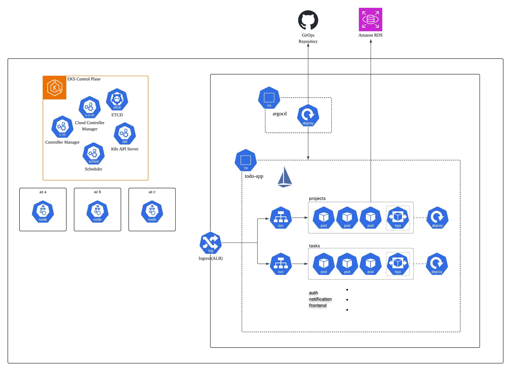

# Kubernetes Architecture Design Log

## v0.1 - 초기 구조

### 구성 요소

- EKS Control Plane (ETCD, Cloud Controller Manager, Controller Manager, K8s API Server, Scheduler)
- 워커 노드 3개 (az a, az b, az c)
- Ingress ALB
- Namespace: argocd, todo-app
- todo-app: frontend, auth, projects, tasks, notification
- Istio 사이드카 인젝션 적용 (todo-app 네임스페이스)

### 문제점

- ArgoCD가 감지할 GitOps Repository 연결 안됨
- ArgoCD -> todo-app 배포 흐름 표현 안됨

## v0.2 - GitOps 연결

### 구성 요소

- GitOps Repository (GitHub) 추가

### 문제점

- 백엔드 서비스(projects, tasks 등)의 Amazon RDS 연결 표현 안됨

## v0.3 - RDS 연결 추가

### 구성 요소

- Amazon RDS 추가 (클러스터 외부)

### 문제점

- HPA 적용 여부가 구성도에 명시되지 않음

## v0.4 - HPA 구성

### 구성 요소

- HPA 아이콘 추가 (오토스케일링 적용 명시)

### 문제점

- 고민 중(Secret, ConfigMap 관리 방법, Istio 모니터링 도구 도입여부)
