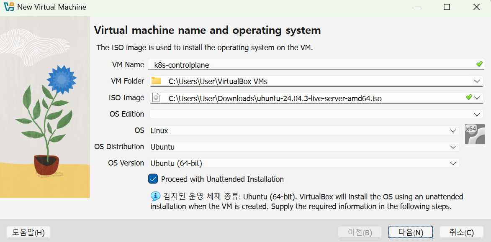
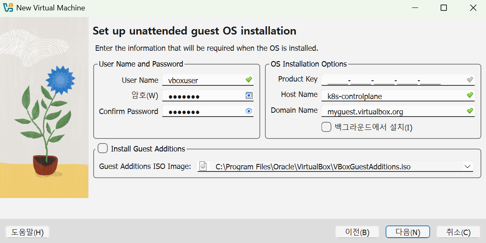
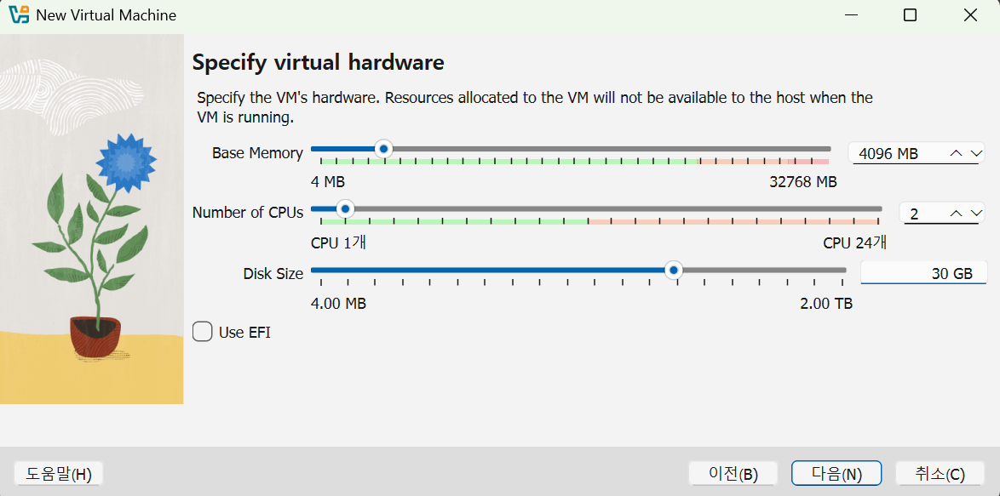
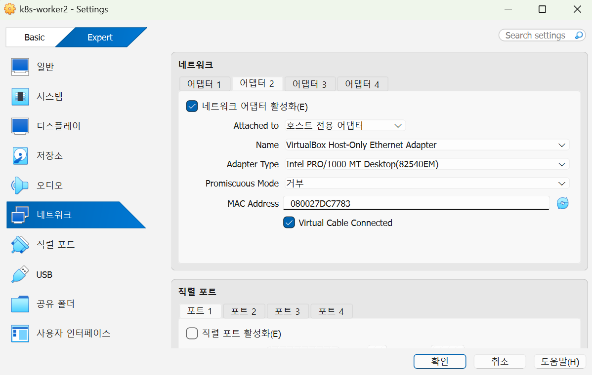

# VirtualBox로 직접 VM 생성하기

## 목차

- [VirtualBox](#VirtualBox)
- [SSH 클라이언트 - MobaXterm](#ssh-클라이언트---mobaxterm)
- [VM 생성](#vm-생성)

---

## VirtualBox

### VirtualBox란?

VirtualBox는 Oracle이 개발한 `오픈소스 가상화 소프트웨어`다.
하나의 물리머신 위에서 여러개의 가상머신(VM, Virtual Machine)을 동시에 실행할 수 있게 해주는 소프트웨어로 Windows, macOS, Linux 모두에서 동작한다.

```
구조: 하드웨어 > 호스트OS > 하이퍼바이저(Type2) > 게스트OS(VM)
```

`Type2 하이퍼바이저`라는 말은 베어메탈 방식이 아니라 기존 호스트OS 위에 애플리케이션처럼 설치되어 동작한다는 뜻.

### VirtualBox 설치

설치 버전: 7.2.6

- 사이트에서 설치파일 다운로드

  https://www.virtualbox.org/wiki/Downloads

- winget으로 설치

  ```bash
    winget install --id Oracle.VirtualBox -v 7.2.6 -e
  ```

  > `winget`이란 Windows Package Manager로 마이크로소프트가 개발한 오픈소스 명령줄 패키지 관리자<br>
  > 별도의 웹사이트 방문 없이 터미널(CMD/PowerShell)에서 `winget` 명령어로 애플리케이션을 검색, 설치, 업데이트, 제거 가능

- VirtualBox 설치 확인

  ```bash
  winget list virtualbox
  이름                    장치 ID           버전  원본
  -------------------------------------------------------
  Oracle VirtualBox 7.2.6 Oracle.VirtualBox 7.2.6 winget
  ```

## SSH 클라이언트 - MobaXterm

전 회사에서 XShell만 사용했었는데 이제 퇴사도 했고, 다른 툴 사용해보고 싶어서 검색해봤다.

- 세션 여러개 접속되는가?
- 터미널 글자 색 구분 뚜렷한가?(나 에러야! 나 디렉토리야! 같이 자기주장 강한거)
- 키 저장 되는가?

Terminus가 폰이나 태블릿으로도 접속이 가능하다해서 혹했지만 일하는게 아니라 개인용으로 쓸 건데 폰으로 접속할 일이 있을까 싶었고, 터미널 글자 색들이 구분이 잘 안가는 느낌이었다.

Tabby는 테마, 폰트 커스텀 가능하다고 했는데 커스텀까지는 귀찮다..

MobaXterm 그냥 화면이 마음에 들었다. 아이피 주소 다른 색깔로 구분해줘서 보기 편하다!

- 사이트에서 설치 파일 다운로드

  https://mobaxterm.mobatek.net/download-home-edition.html

## VM 생성

### Ubuntu 24.04 ISO 다운로드

- 사이트에서 `ubuntu-24.04-live-server-amd64.iso` 다운로드

  https://releases.ubuntu.com/noble/

### VirtualBox에서 새 VM 생성

VirtualBox 실행 > 새로 만들기 클릭

- VM Spec

  | Name             | Role          | CPU    | RAM     | Disk  |
  | ---------------- | ------------- | ------ | ------- | ----- |
  | k8s-controlplane | Control Plane | 2 Core | 4096 MB | 30 GB |
  | k8s-worker1      | Worker Node   | 2 Core | 2048 MB | 20 GB |
  | k8s-worker2      | Worker Node   | 2 Core | 2048 MB | 20 GB |
  | k8s-worker3      | Worker Node   | 2 Core | 2048 MB | 20 GB |

  예전에 최소로 구성했다가 속터짐 이슈생김.<br>
  나의 정신 건강과 원활한 테스트를 위해 권장 사양으로 스펙 올려봄.

  
  
  

### VirtualBox 네트워크 구성

1. VM 생성이 완료되면 전원을 모두 끈다.
2. VM 클릭 > 오른쪽 버튼 클릭 > 설정 > Expert > 네트워크 > 어댑터2 클릭
3. 네트워크 어댑터 활성화(E) 체크박스 체크
4. Attached to에서 `호스트 전용 어댑터` 선택 후 `확인`버튼 클릭
5. VM 4개(controlplane 1개, worker3개) 모두 `호스트 전용 어댑터` 추가해주기

   추가로, 관리하기 편하게 그룹으로 묶어주었다.
   

### Host-Only 네트워크 인터페이스 활성화 (DHCP)

1. 각 VM 오른쪽 버튼 클릭 > 시작 > Start with GUI 클릭

2. vm 접속 후 `ip a` 명령어로 `enp0s8` 확인
   아마 `192.168.56.x` 가 아니라 `DOWN` 으로 되어 있을 것이다.

   ```bash
   ip a
   ~
    3: enp0s8: <BROADCAST,MULTICAST> mtu 1500 qdisc noop state DOWN group default qlen 1000
        link/ether 08:00:27:c7:97:f3 brd ff:ff:ff:ff:ff:ff
   ```

3. netplan으로 DHCP 켜기

   **파일명은 환경마다 다를 수 있으니 ls /etc/netplan/ 으로 먼저 확인한다.**

   ```bash
   sudo vi /etc/netplan/50-installer-config.yaml
   ```

   수정:

   ```yaml
   network:
     version: 2
     ethernets:
       enp0s3:
         dhcp4: true
       enp0s8:
         dhcp4: true
   ```

4. netplan apply

   ```bash
   sudo netplan apply
   ```

5. 적용 확인

   ```bash
   ip a
   ~
   3: enp0s8: <BROADCAST,MULTICAST,UP,LOWER_UP> mtu 1500 qdisc fq_codel state UP group default qlen 1000
       link/ether 08:00:27:c7:97:f3 brd ff:ff:ff:ff:ff:ff
       inet 192.168.56.103/24 metric 100 brd 192.168.56.255 scope global dynamic enp0s8
         valid_lft 437sec preferred_lft 437sec
       inet6 fe80::a00:27ff:fec7:97f3/64 scope link
         valid_lft forever preferred_lft forever
   ```

### SSH 서버 설치 및 MobaXterm 접속 확인

VM 안에서 SSH 서버 설치

```bash
sudo apt update
sudo apt install -y openssh-server
sudo systemctl start ssh
```

ssh 설치 후 `active`인지 확인

```bash
sudo systemctl status ssh

● ssh.service - OpenBSD Secure Shell server
     Loaded: loaded (/usr/lib/systemd/system/ssh.service; disabled; preset: en>
     Active: active (running) since Wed 2026-04-15 10:28:36 UTC; 29min ago

```

### SSH 클라이언트(MobaXterm) 접속 테스트

SSH 클라이언트(Mobaxterm)에서 세션 접속
Remote host: `enp0s8` 에 있던 IP 주소(192.168.56.x)
Username: vboxuser
Port: 22

접속 성공!

이제 쿠버네티스 클러스터 구축 준비 완료.
다음 단계에서 모든 노드에 컨테이너 런타임과 kubeadm을 설치한다.
